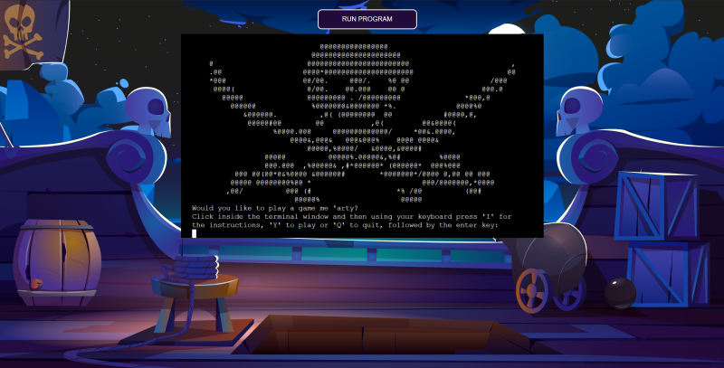

# Calico Jack

## Introduction

Calico Jack is a browser-based game built in Python. It is based on the classic game of Battleships and is themed loosely around the infamous pirate Calico Jack and the night he was captured by Jonathan Barnet.

As the game was developed in Python for use in the terminal, it utilises the Code Institute Python Template to generate a "terminal" onto the page, making it available within a web browser.

Please note: To open any links in this document in a new browser tab, please press CTRL + Click.

## Table of Contents
* [User Experience Design (UX)](#UX)
    * [The Strategy Plane](#The-Strategy-Plane)
        * [Site Goals](#Site-Goals)
        * [User Stories](#User-Stories)
    * [The Scope Plane](#The-Scope-Plane)
    * [The Structure Plane](#The-Structure-Plane)
        * [Opportunities](#Opportunities)
    * [The Skeleton Plane](#The-Skeleton-Plane)
        * [Wireframes](#Wireframe-mockups)
        * [Logic Flow](#Logic-flow)
    * [The Surface Plane](#The-Surface-Plane)
* [Features](#features)
* [Future Enhancements](#future-enhancements)
* [Testing](#testing)
* [Deployment](#deployment)
* [Credits](#credits)

## UX
### The Strategy Plane

* Calico Jack is intended to be a fun strategy battleships game, suitable for individual users looking to play a game for short or medium periods of time. Given the limitations of the terminal-based interface, care will need to be taken to incorporate visual stimulus, along with an engaging narrative to convey an element of fun to the user. 

#### Site Goals

* To provide users with a fun and simple strategy game to play.
* To provide users with alternative board dimensions to increase or decrease the time commitment required to complete a game.
* To provide users with alternative difficulty levels to increase or decrease the challenge offered.

### User Stories

* As a user I want an online version of battleships to play
* As a user I want to be able to control the amount of time it takes to play the game.
* As a user I want to challenge myself against a tough computer opponent.

### The Scope Plane

**Features planned:**
* As there are certain restrictions in the scope of the development of the application, such as the terminal confines and methods of deployment. It will be important to ensure all functionality is contained within the game terminal screen.
* Despite the confines of the terminal emulator, the site should site be visually stimulating and clear to the user that it is a game.
* Three difficulty levels should be available to the user.
    * Easy - Normal - Hard
* Two different size boards should be available to the user.
    * The traditional 10 tile by 10 tile board size along with a smaller board for quicker gameplay.

### The Structure Plane

User Story:

> As a user, I want a fun and simple strategy game to play

Acceptance Criteria:
* It should be clear to the user that this is a game, what it is about and how to play.

Implementation:
* The layout, use of colour and in game narrative will all be designed to immerse the user into the game world. Conveying a sense of fun to the user throughout the interactions with the game. Instructions on how to play will be available at the start of the game, along with clear prompts and validation for each user input.

User Story:

> As a user, I want to be able to control the amount of time it takes to play the game.

Acceptance Criteria:
* The user should be able to control the amount of time it takes to play a game.

Implementation:
* The user will have the ability to choose between two different board sizes. The smaller board will contain a smaller number of potential target tiles, along with a smaller number of ships to potentially hit, thus reducing the amount of time required to complete the game. The larger board size will contain more ships, which combined with the larger number of potential tile targets will extend the game play. The three difficulty levels offered will also impact the game time due to the algorithm controlling how the AI selects its targets. Harder difficulty levels will potentially result in shorter time periods required to play the game.
* The user will also have the ability to exit a game at any point without quitting the application. This will allow the user to further control the time within the game. 

User Story:

> As a user, I want to challenge myself against a tough computer opponent.

Acceptance Criteria:
* The user should have the option to play the game on different difficulty level settings.

Implementation:
* The user will have the ability to choose between three different difficulty levels. Each level will alter the challenge that the AI player provides.

#### Opportunities

Arising from user stories
| Opportunities | Importance | Viability / Feasibility
| ------ | :------: | :------: |
| ** Provide a fun game environment ** | 5 | 5 |
| ** Provide different difficulty levels ** | 5 | 5 |
| ** Provide ability to control the time the game takes ** | 5 | 5 |

### The Skeleton Plane
#### Wireframe mock-ups

Given that the application will be run within a terminal emulator provided within the template, there are limited options available with regards to the layout of the webpage itself. Early on within the development of the theme, I located a suitable background graphic on iStock. To position the terminal appropriately for the background graphic, and keeping user experience in mind, I decided to centre the terminal horizontally on the screen. This positions the terminal window within the lower part of the rail around the ship in the background graphic. The run program button was centrally positioned to above the terminal window to emphasis its importance.

For the terminal window itself, I also produced a wireframe in the well-known design package Microsoft Excel. Whilst not traditionally used for this purpose, the terminal window dimensions of 80 columns wide by 24 rows high provided a restriction that I could duplicate in excel easily. This enabled me to work out the spacing requirements and dimensions of the elements on screen during the gameplay. Given that all the elements that would be displayed in the terminal are ASCII characters, creating an 80 x 24 grid in excel with one character per tile it enabled me to easily see if I could fit the total information required on each line. This was especially useful whilst calculating how to print the two game boards with a scoreboard in between them, given the line-by-line method in which the terminal prints.

#### Logic Flow

To develop the logical steps required within the game, along with gaining an understanding of how the different game elements would interact, I created a flow chart detailing the individual steps for the game. Given the scope of the game logic involved the full flow chart resulted in a large image. The full image can be viewed here [Logic Flow Diagram](/assets/logic/logic-flow-full.png)

The game logic can be broken down into three distinction sections. The initial setup of the game, taking a turn and checking the turn result before moving to the next player. For ease of reference, I have broken up the logic flow diagram into these three sections.

##### Setup Logic

##### Target Selection and Validation

##### Game Loop

#### Programming Paradigm

I utilised an Object Orientated Programming approach to developing the game. Two initial functions will be utilised to establish the game parameters such as the board size and the difficulty. This data will then be used to establish the game instance. The game instance will be utilised to control the flow of the game, present data to the user and establish other objects as needed. The game instance will establish the two players of the game, the player, and the computer. It will also establish a blank board for the player to use when playing the game.

The player object and the comp object will establish their own instances of the objects they require such as playing boards and ships. I intend on keeping the playing boards and the ships as separate objects. This will allow me to track placement of individual ships on the individual boards. It should also enable me to track the health of each ship for use in a scoreboard which will be displayed to the user.

I will utilise a variety of methods on each class to play the game. The Game class will contain methods for the general running of the game itself. The Player class will contain methods that will manipulate the data inputted by the user into game actions such as placing ships or taking shots. The Comp class will contain methods associated with similar actions as the Player class however they will need to be automated actions that are calculated by the computer and not because of user input. The Board and Boat classes will contain methods used to manage the objects they create.

### The Surface Plane

#### Design

Once I was happy with the overall layout of the page, I created a full colour mock-up within Adobe XD.

## Features
#### Welcome Screen

At the start of game users are greeted with a welcome screen showing the game logo of the skull and crossed swords pirate flag. The game asks the user if they would like to play a game, with instructions on how to start the game, or access the instructions

#### Instructions Screen

If users select the instructions option from the main menu the screen will display an overview of the story behind the game and the objective for the user. They are then presented the same message as the welcome screen asking if they would like to play a game.

#### Dimension Selection Screen

When the user confirms that they would like to play the game, they are greeted by a message asking them what size board they would like to use.

#### Difficulty Selection Screen

Once the board size is selected the user is prompted to decide what difficulty level they would like.

#### Transition to Ship Placement Screen

The game will then progress to the ship placement phase of the setup, with the user required to press enter to start. Once the user has indicated that they are ready, they are prompted with the details of the first ship to be placed and asked where they would like to place the ship.

#### Orientation Selection Screen

If the ship can be placed in both horizontal and vertical orientations the user will get the choice over orientation, however if the ship can only be placed in one orientation, the game will place the ship automatically and move onto the next ship to be placed. If the ship cannot be placed at the location specified, they will be prompted with a message informing them as to why and asked to pick a different location.

#### One Ship Placed Screen

Once the ship has been successfully placed, the user will see an updated game board showing the location of the ship, along with a message asking them to place the next ship.

#### Two Ships Placed Screen

This loop will continue until all the ships required have been placed by the user.

#### Game Start Screen

Once all the ships have been placed, the user receives a message informing them of the arrival of the enemy. Following the message, the game will change to a new screen showing a targeting board, a scoreboard, and a copy of their own board. There is also an additional message explaining to the user the information on the screen. The game will then prompt the user for the location of their first shot.

#### Shot Result Screen - Miss

Once the user has inputted a valid target location, the game will update the screen with the result of the user shot, along with the result of the AI shot. The boards will be updated to display the shots previously taken. On the users targeting board the result of the user shot is shown either as a ~ with a blue background, or a red # showing a hit. The result of the AI shot is shown on the player board itself; a miss being shown as a yellow M with a hit being shown as a red #.

#### Shot Result Screen - Hit

Users are also provided with a message informing them of the result of the AI hit, the messaging is different for each potential shot result.

#### Scoreboard

In the middle of the game screen a scoreboard displays the number of ships remaining for each player. It also shows the user the number and type of ship remaining. 

#### Updated Scoreboard

The scoreboard will update to display the correct number of ships remaining as and when a ship is sunk.

#### End Game Screen

Once the user (or the AI) has sunk all the opponent's ships, they will win the game and be presented with a message to that effect. The user is then prompted to play again.

## Future Enhancements

High scores - It would be a nice addition to the game to develop a scoring system which enabled the users to compete against themselves or other users in the game. The scores could be saved to a database which users could access to see where they rank through a high score screen.

Multiplayer - It would also be a nice addition to the game to enable users to play against other human players over the internet.

## Testing

### Testing Strategy

I took a two-stage approach to testing the application. The first stage was continuous testing as the application was being developed. With the application being based within the terminal, it was straight forward to test functions and print statements as they were being developed using the terminal within the IDE. During this stage of testing multiple tests were conducted to ensure sections such as the AI ship placement and shot selection were performing correctly. This involved writing functions and print statements to enable me to see what the AI was calculating and where it was placing ships. These were removed from the final version of the game on September 13th, 2021.

For the second stage of testing, I utilised a more formal structured approach and created a test schedule for the application which covered each logical cycle. I then proceeded to run through the manual tests I'd developed one at a time noting the result and recording any errors found. Where unexpected behaviour was encountered, the code was altered to correct the behaviour. Whilst in finally testing no major bugs were found, I did discover a few validation requirements that I did not think about whilst initially developing the application.  These were easily corrected by adding the required validation rules within the validation loops already created. One such situation was during user input for target locations, if the user entered nothing the wrong error message would display.

The individual python files were also validated using [pep8online.com](http://pep8online.com/) further details are below.

#### Testing Overview

Testing was divided into different sections to ensure everything was tested individually with test cases developed for each area.

A full detailed breakdown of the testing procedures and methodology can be found in the testing.md file [here](TESTING.md)

#### Validator Testing

* pep8online.com - I utilised [pep8online.com](http://pep8online.com/) to validate my python code. All python files were checked with no errors reported.
* The following files however did include warnings regarding a line break before binary operator
    * board.py - 2 warnings
    * comp.py - 1 warning
    * game.py - 27 warnings
    * player.py - 2 warnings
    * setup.py - 4 warnings
    * The warning suggests that there should not be a line break before a binary operator, however on checking with the python pep 8 guidelines it states that the line break should be before the binary operator. The point in the PEP8 guidelines can be found [here](https://www.python.org/dev/peps/pep-0008/#should-a-line-break-before-or-after-a-binary-operator). As the guidelines may have been updated more recently than the validator, the warning message regarding the binary operators was ignored.

* Screenshots of the validator reports are here:
    * [blank.py file](/assets/screenshots/blank.png)
    * [board.py file](/assets/screenshots/board.png)
    * [boat.py file](/assets/screenshots/boat.png)
    * [comp.py file](/assets/screenshots/comp.png)
    * [editscreen.py file](/assets/screenshots/editscreen.png)
    * [game.py file top](/assets/screenshots/game.png)
    * [player.py file](/assets/screenshots/player.png)
    * [run.py file](/assets/screenshots/run.png)
    * [setup.py file](/assets/screenshots/setup.png)
    * [start.py file](/assets/screenshots/start.png)

#### Notable Bugs

There were no real bugs of note within the project. I encountered a few difficulties in working with 2d arrays and remembering which way round the indexing would reference which I eventually overcame. The only other issue encountered was including a favicon due to the way the template and terminal emulator works. To overcome this with the help of Sean in CI tutor support I switched the favicon from an image file stored within the site files to a file located on a cloud hosting site. This solution overcame the issues with importing local files into the template.

A minor bug that I encountered during the development of the project came to light during the implementation of the clear_terminal function. I discovered that the terminal emulator used within the template would not support this functionality. After exhausting some other potential methods of implementing the desired functionality, I removed the original template code from the project and replaced it with the latest version.

#### Libraries Utilised
##### Built in Python Libraries

Several of the built in python libraries were utilised to enable additional functionality within the application.
##### math
The math library was imported to utilise the math.floor functionality. This was used during the calculation of the correct number of ships that each player should have. I included this as a calculation instead of just setting the value to enable the value to adjust if the dimensions of the board are different. It would now be possible to add a much larger board to the game without creation of the ships getting broken.
##### time
The time library was imported to utilise the time.sleep functionality. This enabled me to incorporate specific time delays within the program which adds to the player experience by simulating the time between the player move and the computers response. Whilst only a small time delay occurs, I felt that it was a much better experience than the computer move appearing as soon as the player entered their own move. 
##### os
The os library was imported to utilise the os.system and os.name functionality. This enabled me to add functionality to the terminal emulator which allowed me to clear the previous print statements. This provides a clearer and more structured experience for the user.
##### random
The random library was imported to access a number of the built in methods of generating a random selection. It was primarily utilised during the AI shot selection algorithms to select a random location to fire, or a random location from a generated list of options.
##### string
The string library was imported to enable the ability to convert the alphabetical characters into numeric values whilst positioning or targetting ship locations. It was preferred to include a grid selection pattern of an letter then an number rather than two numbers to make it easier for users to select locations. It is much harder for a user to select the wrong location when using a letter and a number rather than two numbers.

## Deployment

The site was deployed via Heroku.

The project was developed utilising a Code Institute provided template. During the development of the project the template was updated to increase functionality. I switched over to the new template mid project which you can see within the commit history. Some of the deployment steps below are specifically required for the new CI template and may not be applicable to older versions, or different projects.

### Project Deployment

To deploy the project through Heroku I followed these steps:
* Sign up / Log in to [Heroku](https://www.heroku.com/)
* From the main Heroku Dashboard page select 'New' and then 'Create New App'
* Give the project a name - I entered Calcio-Jack and select a suitable region, then select create app. The name for the app must be unique.
* This will create the app within Heroku and bring you to the deploy tab. From the submenu at the top, navigate to the settings tab.
* This next step is required for creating the app when using the CI Python Deployment Template. If you created your own program without using the CI Template, you might not need to add a config var.
* In the config vars section select the reveal config vars button. This will display the current config vars for the app, there should be nothing already there.
* In the KEY input field input PORT all in capitals, then in the VALUE field input 8000 and select the Add button to the right.
* Next select the add buildpack button below the config vars section.
* In the pop-up window select Python as your first build pack and select save changes.
* Then repeat the steps to add a node.js buildpack.
* The order of the buildpacks is important, in the list Python should be first with Node.js second. If they are not in this order, you can click and drag them to rearrange.
* Next navigate back to the deploy tab using the submenu at the top of the page.
* In the deployment method section select the GitHub - Connect to GitHub button and follow the steps prompted if any to connect your GitHub account
* In the Connect to GitHub section that appears, select the correct account, and enter the name of the repository and select search.
* Once Heroku has located the repo select connect.
* This will connect the repo to the app within Heroku. Below the Apps Connected to Heroku section will be the Automatic Deploys section.
* In this section, confirm the correct branch of the repo is selected in the drop-down box, and then click the Enable Automatic Deploys button
* This will ensure whenever you change something in the repo and push the changes to GitHub, Heroku will rebuild the app. If you prefer to do this manually you can utilise the manual deployment options further down. For this project I utilised the Automatic Deployment to enable me to check changes I made to the app as I developed it.
* Heroku will now build the app for you. Once it has completed the build process you will see a 'Your App Was Successfully Deployed' message and a link to the app to visit the live site.

## Credits

### Code

I was informed of a method to clear the terminal by another student on the course Goran Sigeskog who had found the method in a Python cheat sheet provided by [coding4you](http://www.coding4you.at/inf_tag/beginners_python_cheat_sheet.pdf). Goran had used the method successfully within his project. The code is credited within the editscreen.py file. Goran's GitHub can be found [here](https://github.com/gorsig).

#### Difficulty Levels

For the different difficulty levels, I referenced an article I discovered about the game and the best strategies to win. The author broke down the statistical probability of winning at battleships using a random shot approach, a random approach and then targeting the neighbouring tiles when you get a hit, and finally a strategic approach on how to choose initial target tiles. Whilst the article does not discuss how you would code or create the algorithms needed, I did base the algorithms I created heavily on these three different approaches to the game. The original article can be found here on the [Data Genetics site](https://www.datagenetics.com/blog/december32011/index.html). Ultimately, I did not fully implement the splitting the board in two and only targeting every other tile. Whilst I had originally intended on incorporating this, I deemed the hard difficulty level hard enough without it and did not want to make it unbeatable.

### Content

#### Background Image

Whilst searching the various free image sites for the perfect pirate themed background image I came across the image I eventually used on an iStock banner ad. Whilst I typically avoid the paid service sites, I thought this image was perfect for the theme so bit the bullet and paid the €9.00.
The image can be found on [iStock](https://www.istockphoto.com/vector/pirate-ship-wooden-deck-onboard-night-view-vector-gm1303787798-395138389?clarity=false)
Stock illustration ID:1303787798
Artist: klyaksun

#### Stack Overflow

Stack overflow was useful a few times whilst I developed my understanding and grasp of 2d arrays and overcoming circular references. One post I referenced to develop using colours within the terminal window and can be found [here](https://stackoverflow.com/questions/287871/how-to-print-colored-text-to-the-terminal)

#### Haoyi's Programming Blog

Whilst further researching utilising different colours within the terminal I discovered Haoyi's programming blog. Whilst ultimately, I did not use the techniques detailed in the finished app, it did provide me with several ideas on how I could incorporate colours within the terminal. It is worth a read if you are looking at animating or using colour within a terminal window and can be found [here](https://www.lihaoyi.com/post/BuildyourownCommandLinewithANSIescapecodes.html)

#### Wikipedia

Wikipedia was used as a reference point for details of the history and tales surrounding Calico Jack, the infamous pirate our user is defending. [Calico Jack](https://en.wikipedia.org/wiki/Calico_Jack)

### Acknowledgements

I'd like to thank the following:
* My mentor Rahul Lakhanpal for encouraging me throughout the project.
* Daisy McGirr and Ben Kavanagh for helping me understand OOP and Python Classes better.
* Sean and John at CI Tutor support for their patience and pointing me in the right direction when I went off course.
